# Live Tab Captioner

A Chrome extension that captures active tab audio in real-time and transcribes it locally using Whisper. Perfect for generating live captions for videos, presentations, and other audio content without sending data to external services.

## Badges

### Runtime Environment

- **No external API calls** - All transcription happens locally in the browser
- **Privacy-first** - Audio data never leaves your machine
- **Cross-platform** - Works on any system running Chrome/Edge with Manifest V3 support

### Key Features by Technology

| Technology | Purpose |
|-----------|---------|
| **WASM** | Executes Whisper model with near-native performance |
| **Whisper ONNX** | Provides accurate, multilingual speech recognition |
| **tabCapture API** | Enables seamless audio extraction from active tabs |
| **Service Worker** | Manages extension lifecycle and background operations |
| **Side Panel API** | Modern UI presentation in Chrome's side panel interface |

## System Workflow

```mermaid
graph TB
    subgraph Browser["🌐 Chrome Browser"]
        subgraph ActiveTab["Active Tab"]
            Audio["🎵 Audio Stream"]
        end
        
        subgraph ExtArch["Extension Architecture"]
            subgraph UI["UI Layer"]
                SidePanel["Side Panel<br/>sidepanel.html"]
                SideScript["sidepanel.js<br/>Event Handler"]
            end
            
            subgraph Worker["Background Service Worker"]
                BgScript["background.js<br/>Lifecycle Manager"]
            end
            
            subgraph Sandbox["Sandbox Environment"]
                Sandbox_HTML["sandbox.html<br/>WASM Container"]
                Whisper["Whisper ONNX Model<br/>Local Transcription Engine"]
            end
        end
    end
    
    Audio -->|Chrome tabCapture API| BgScript
    BgScript -->|tabCapture Stream| SideScript
    SideScript -->|Raw Audio Chunks| Sandbox_HTML
    Sandbox_HTML -->|Process via WASM| Whisper
    Whisper -->|Transcribed Text| SidePanel
    SidePanel -->|Display with Timestamps| User["👤 User"]
    SidePanel -->|Language Selection| SideScript
    
    style Browser fill:#e3f2fd
    style ExtArch fill:#f3e5f5
    style UI fill:#fff3e0
    style Worker fill:#e8f5e9
    style Sandbox fill:#fce4ec
```

Raw Mermaid Source Code

### Architecture Components

**Browser Tab Layer**
- Captures audio from the active tab using Chrome's `tabCapture` API

**Extension UI Layer** (`sidepanel.html` / `sidepanel.js`)
- Displays the captioner interface with language selection
- Shows live captions with timestamps in real-time
- Manages start/stop capture controls
- Communicates with the sandbox for transcription

**Background Service Worker** (`background.js`)
- Lifecycle manager for the extension
- Handles extension icon clicks to open the side panel
- Routes audio stream from the tab to the UI layer

**Sandbox Environment** (`sandbox.html` / `sandbox.js`)
- Isolated execution context for WASM-based Whisper model
- Processes audio chunks without access to user data or network
- Returns transcribed text to the side panel for display
- Security boundary ensures local-only processing

## Installation

1. Clone or download this repository
2. Open Chrome and navigate to `chrome://extensions/`
3. Enable "Developer mode" in the top-right corner
4. Click "Load unpacked" and select the `live-tab-captioner` folder
5. The extension icon will appear in your Chrome toolbar

## Usage

1. Open a webpage with audio (video, presentation, podcast, etc.)
2. Click the Live Tab Captioner extension icon
3. Select your preferred language from the dropdown
4. Click **Start Capture** to begin transcribing
5. Live captions will appear in the side panel with timestamps
6. Click **Stop Capture** when finished
7. Captions remain visible until you close the side panel

### Features

- **Real-time transcription**: Captions appear as audio is processed
- **Multiple languages**: Switch between English, Japanese, Chinese, and Spanish
- **Local processing**: All transcription happens locally—no data sent to servers
- **Timestamps**: Each caption includes timing information
- **Clean UI**: Simple, intuitive interface with status indicators